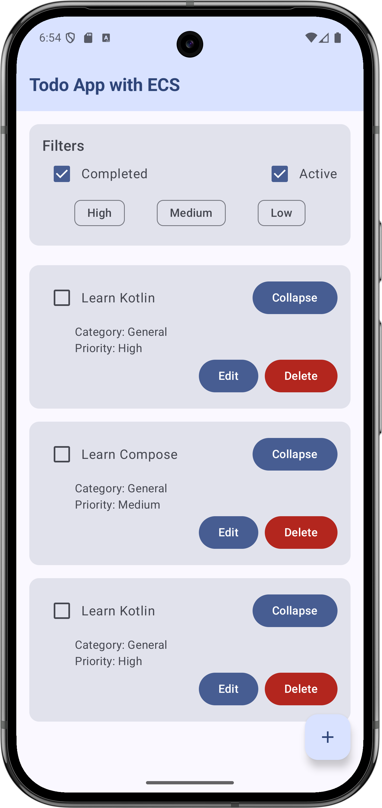

# Kotlin Entity Component System (ECS) Library

An event-driven Entity Component System (ECS) framework for Kotlin, designed for app development and
Compose UI integration.
This is a experimental project to explore the use of ECS in app development. This is not a
production ready library and is not intended to be used in production.

---

### Screenshots

## What is ECS?

**Entity Component System (ECS)** is a design pattern that separates data (components) from logic (
systems), allowing for flexible, efficient, and scalable application architecture. It is widely used
in game development and is increasingly popular for general app logic.

- **Entities**: Unique IDs representing objects in your app.
- **Components**: Data-only classes attached to entities (e.g., `Position`, `Health`, `TodoText`).
- **Systems**: Logic that operates on entities with specific components (e.g., rendering, filtering,
  updating state).
- **Events**: Messages that trigger system logic and enable decoupled communication.

---

## Features

- **Dynamic Entities**: Create and destroy entities at runtime.
- **Flexible Components**: Add, remove, and update components on entities.
- **Event-Driven Systems**: Systems react to events and process only relevant entities.
- **Jetpack Compose Integration**: Compose-friendly APIs for observing components and registering
  systems.

---

## Getting Started

Read the Main Activity `MainActivity.kt` and examples in app module [TodoApp.kt](app/src/main/java/io/github/neerajshdev/example/TodoApp.kt)

## Running the App

1. **Open the project in Android Studio.**
2. **Build and run the app** on an emulator or device.
3. The main entry point is `MainActivity`, which launches the Compose UI (`TodoApp()`).

You can also run the ECS logic in a console context using the `main()` function in `TodoApp.kt` for
non-UI testing.

---

